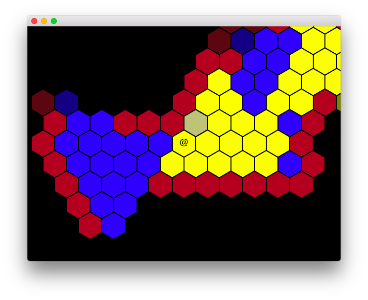
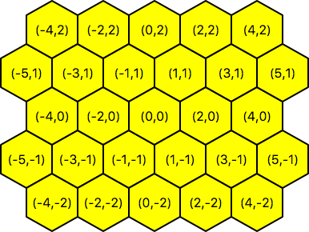
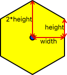

# hexutil
Classes and functions to deal with hexagonal grids.

## Introduction

This module provides the following functionality.

1. Manipulation of grid coordinates in a hexagonal grid.
2. Converting between hexagonal grid coordinates and screen coordinates.
3. Field-of-view calculation on a hexagonal grid.
4. A\* path-finding on a hexagonal grid.

All this is provided by the module `hexutil`.
The file [example.py](example.py) contains example coding using this functionality.
The above image is a screenshot from this example.

## Manipulation of grid coordinates in a hexagonal grid.

The class `hexagon.Hex` represents a particular hexagon in a grid.
Class `Hex` takes two integer arguments, `x` and `y`. 
These need to satisfy the property that their sum is even.

The following (x,y) coordinate system is used to address hexagons in the grid.

At first, it may seem weird that this coordinate system leaves "holes" in the representation, 
i.e. there is no hexagon corresponding to, say,  (0, 1). However, that turns out to be not a real problem in practise.
The advantage is that relationship to the actual center points of the hexagons becomes very simple, namely, just
multiply `y` with √3. This also simplifies screen coordinate calculations.

The only time the "holes" are an issue is if you want to pack grid data densely into a 2D (numpy) array or a list-of-lists. In that case, just use 
`ar[hexagon.x//2][hexagon.y]` to index into array `ar`.

The constructor of `Hex` checks the "x+y is even" property. If it is not satisfied, an `InvalidHex` exception is thrown.

Note that `Hex` is a namedtuple. That means that it can be used wherever a 2-tuple (x, y) is required.
It also means that is is immutable.

Important functionality on instances of `Hex`.
* The `hex.x` and `hex.y` fields for accessing the x- and y-coordinate, respectively.
* Arithmetic operations `hex1 + hex2`, `hex1 - hex2` and `- hex` are supported.
* The method `hex.neighbours()` returns the 6 direct neighbours of a hex.
* The method `hex1.distance(hex2)` returns the distance in terms of steps on the hexagon grid between `hex1` and `hex2`.

## Converting between hexagonal grid coordinates and screen coordinates.

The mapping of a hexagon to screen (pixel) coordinates can be described by two parameters `width` and `height`.
The following image shows how these relate to the hexagon size.

For a perfectly regular hexagon, the relationship `height = ⅓√3 width` should hold. In practice, we typically want integral pixel coordinates.

The class `HexGrid` captures such a pair of `width` and `height` values. It can be initialized as `HexGrid(width, height)`
or `HexGrid(width)`. In the latter case, `height` is automatically computed as `round(⅓√3 * width)`.

Important functionality on instances of `Hex`.
* The `hexgrid.width` and `hexgrid.height` fields for accessing the width and height, respectively.
* Method `hexgrid.center(hex)` returns a pair (x, y) of screen coordinates of the center of `hex`.
* Method `hexgrid.corners(hex)` returns a sequence of 6 pairs (x, y) of screen coordinates of the 6 corners of `hex`.
* Method `hexgrid.bounding_box(hex)` returns a `hexutil.Rectangle` object describing the bounding box of `hex`.
* Method `hexgrid.hex_at_coordinate(x, y)` returns the `Hex` at screen coordinate (x,y).
* Method `hexgrid.hexes_in_rectangle(rect)` returns a sequence of all `Hex`-es which overlap with `Rectangle` rect.

## Field-of-view calculation on a hexagonal grid.

Field-of-view calculation is done by the following method on `Hex` instances.

` hex.field_of_view(self, transparent, max_distance, visible=None) `

*   transparent  -- from a Hex to a boolean, indicating of the Hex is transparent
*   max\_distance -- maximum distance you can view
*   visible      -- if provided, should be a dict which will be filled and returned

Returns a dict which has as its keys the hexagons which are visible.
The value is a bitmask which indicates which sides of the hexagon are visible.
The bitmask is useful if you want to use this function also to compute light sources.

    view_set = player_pos.field_of_view(...)
    light_set = light_source.field_of_view(...)

    # Is pos visible?
    if view_set.get(pos, 0) & light_set.get(pos, 0):
        # yes it is

## A\* path-finding on a hexagonal grid.

Path-finding (using the [A\* algorithm](https://en.wikipedia.org/wiki/A*_search_algorithm)) is done by the following method on `Hex` instances.

`hex.find_path(self, destination, passable, cost=lambda pos: 1)`

*  hex         -- Starting position (`Hex` object) for path finding.
*  destination -- Destination position for path finding.
*  passable    -- Function of one position, returning True if we can move through this hex.
*  cost        -- cost function for moving through a hex. Should return a value ≥ 1. By default all costs are 1.

This returns the path (as a sequence of `Hex`-es, including start point and destination), or `None` if no path could be found.
